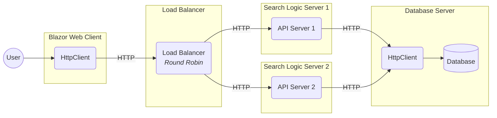
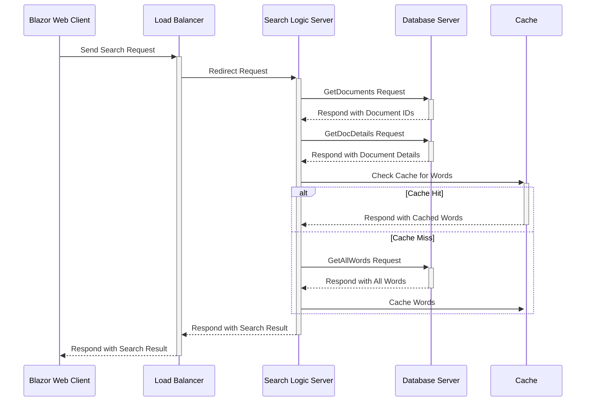

# Project

```mermaid
%%{init: {"flowchart": {"htmlLabels": false}} }%%
flowchart LR
    A((User)) --> B

    subgraph "Blazor Web Client"
        B(HttpClient)
    end

    subgraph "Load Balancer"
        B -- HTTP --> C("`Load Balancer
                        *Round Robin*`")
    end

    subgraph "Search Logic Server 1"
        C -- HTTP --> D1(API Server 1)
    end

    subgraph "Search Logic Server 2"
        C -- HTTP --> D2(API Server 2)
    end

    subgraph "Database Server"
        D1 -- HTTP --> E(HttpClient)
        D2 -- HTTP --> E
        E --> F[(Database)]
    end

```

## Flow

```mermaid
sequenceDiagram
    participant Blazor Web Client
    participant Load Balancer
    participant Search Logic Server
    participant Database Server

    Blazor Web Client ->>+ Load Balancer: Send Search Request

    Load Balancer ->>+ Search Logic Server: Redirect Request

    Search Logic Server->>+Database Server: GetDocuments Request
    Database Server-->>-Search Logic Server: Respond with Document IDs
    Search Logic Server->>+Database Server: GetDocDetails Request
    Database Server-->>-Search Logic Server: Respond with Document Details

    Search Logic Server->>+Cache: Check Cache for Words
    alt Cache Hit
        Cache-->>-Search Logic Server: Respond with Cached Words
    else Cache Miss
        Search Logic Server->>+Database Server: GetAllWords Request
        Database Server-->>-Search Logic Server: Respond with All Words
        Search Logic Server->>+Cache: Cache Words
    end

    Search Logic Server-->>-Load Balancer: Respond with Search Result
    Load Balancer-->>-Blazor Web Client: Respond with Search Result

```