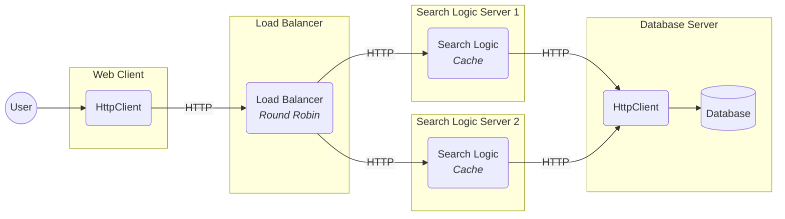
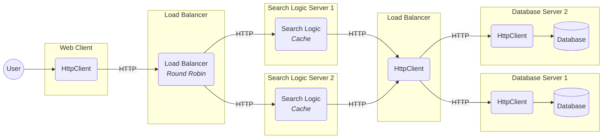
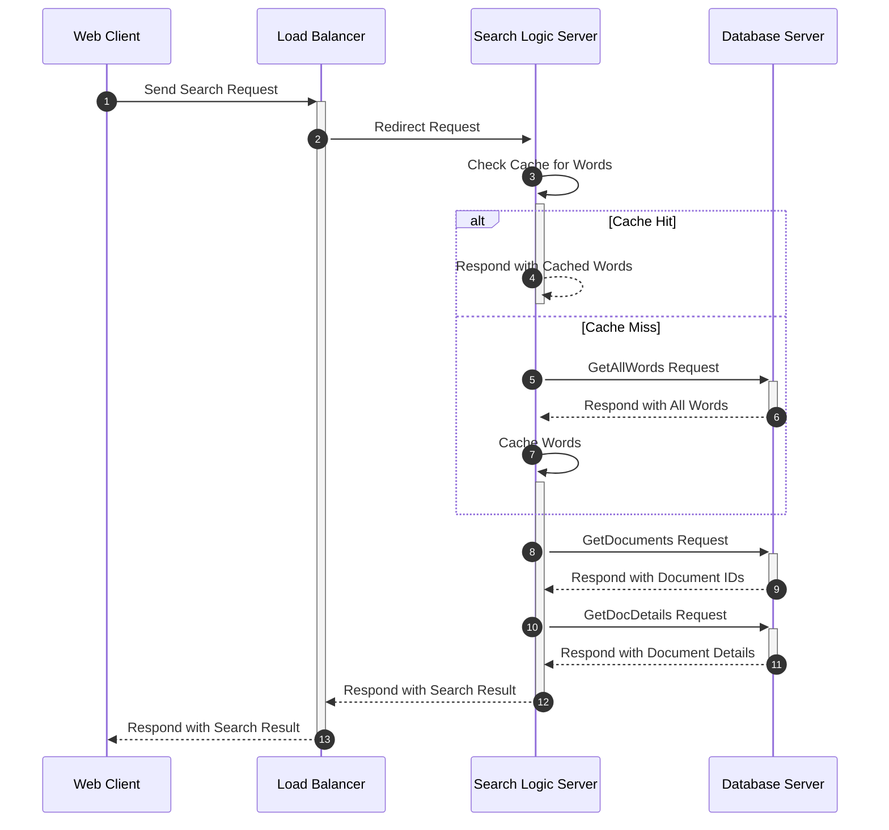

# Project
## AS IS

```mermaid
%%{init: {"flowchart": {"htmlLabels": false}} }%%
flowchart LR
    A((User)) --> B

    subgraph "Web Client"
        B(HttpClient)
    end

    subgraph "Load Balancer"
        B -- HTTP --> C("`Load Balancer
                        *Round Robin*`")
    end

    subgraph "Search Logic Server 1"
        C -- HTTP --> D1("`Search Logic
                            *Cache*`")
    end

    subgraph "Search Logic Server 2"
        C -- HTTP --> D2("`Search Logic
                            *Cache*`")
    end

    subgraph "Database Server"
        D1 -- HTTP --> E(HttpClient)
        D2 -- HTTP --> E
        E --> F[(Database)]
    end

```

## TO BE

```mermaid
%%{init: {"flowchart": {"htmlLabels": false}} }%%
flowchart LR
    A((User)) --> B

    subgraph "Web Client"
        B(HttpClient)
    end

    subgraph "Load Balancer"
        B -- HTTP --> C("`Load Balancer
                        *Round Robin*`")
    end

    subgraph "Search Logic Server 1"
        C -- HTTP --> D1("`Search Logic
                            *Cache*`")
    end

    subgraph "Search Logic Server 2"
        C -- HTTP --> D2("`Search Logic
                            *Cache*`")
    end

    subgraph "Load Balancer"
        D1 -- HTTP --> E(HttpClient)
        D2 -- HTTP --> E(HttpClient)
    end

    subgraph "Database Server 1"
        E -- HTTP --> F1(HttpClient)
        F1 --> G1[(Database)]
    end

    subgraph "Database Server 2"
        E -- HTTP --> F2(HttpClient)
        F2 --> G2[(Database)]
    end

```

## Flow

```mermaid
sequenceDiagram
    participant A as Web Client
    participant B as Load Balancer
    participant C as Search Logic Server
    participant D as Database Server

    autonumber

    A ->>+ B: Send Search Request
    B ->>+ C: Redirect Request

    C->>+C: Check Cache for Words
    alt Cache Hit
        C-->>-C: Respond with Cached Words
    else Cache Miss
        C->>+D: GetAllWords Request
        D-->>-C: Respond with All Words
        C->>+C: Cache Words
    end

    C->>+D: GetDocuments Request
    D-->>-C: Respond with Document IDs
    C->>+D: GetDocDetails Request
    D-->>-C: Respond with Document Details

    C-->>-B: Respond with Search Result
    B-->>-A: Respond with Search Result

```